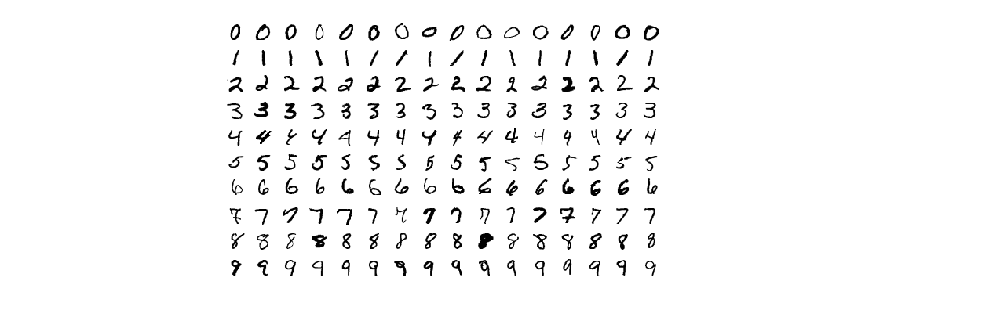
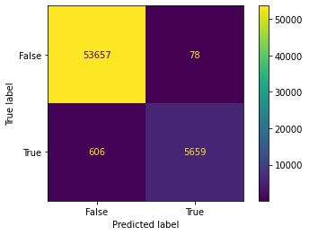
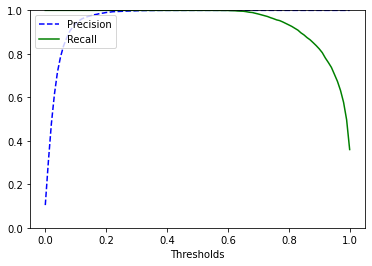

# DS-Project-2-MNIST_Classifier
Created a model that does Handwritten Digit Recognition on the MNIST dataset

* Designed a model that is able to identify hand written numbers.
* Dataset - The MNIST-Dataset is a set of 70,000 small images of digits handwritten by high school students and employees of the US causes Bureau.
  This dataset can be fetched using the fetch_openml library  
* Model - The major aim of in this project is to be able to to identify handwritten digits based on the features using some of the classification techniques and algorithms. I have set a _condition_ for the binary classifier where the model has to identify the digit **7** . 

## Code and Resources Used ##
**Python Version:** 3.10.5  
**Packages:** pandas, numpy, sklearn, matplotlib  
**For Web Framework Requirements:** _pip install -r requirements.txt_  
**Data Resources:** The dataset can be imported using the following code :  
`from sklearn.datasets import fetch_openml`  
` mnist = fetch_openml('mnist_784' , as_frame=False)`  
The 'as_frame' argument imports the dataset as a Numpy array, If it is not mentioned, you will import it as a Pandas Dataframe

## About the Dataset ##
* Set of 70,000 small images of digits handwritten by high school students and employees of the US causes Bureau.
* All images are labeled with the respective digit they represent.
* MNIST is the hello world of machine learning. Every time a data scientist or machine learning engineer makes a new algorithm for classification, they would always first check its performance on the MNIST dataset.
* There are 70,000 images and each image has 28*28 = 784 features.
* Each image is 28*28 pixels and each feature simply represents one-pixel intensity from 0 to 255. If the intensity is 0, it means that the pixel is white and if it is 255, it means it is black.
#### Data Overview ####
This is what the MNIST Dataset looks like.

## Model Building ##
Luckily for us this dataset has already been split into 90% of training data and 10% testing data.  
As for my binary classifier condition, I have decided to create a model that can identify the digit **7**.(SIUUUUUU)  
This condition can change according to your preference  
Since the datasets are initially a string character, for my convinience i use the 'np.astype' to change it to an int character type   

I have tried four different models for this particular dataset.  
1. LogisticRegression classifier:  
2. SGD Classifier:  
3. DecisionTree Classifier:  
4. RandomForest Classifier:  

First, I calculated the confusion matrix of the dataset which gave me an idea of how many of the datasets were predicted inaccurately which is the false negatives and false positives. Below is a representation of the confusion matrix.  

As a most of the classifiers cannot be evaluated by accuracy metrics, I have calculated the precision -  which is the percentage of accurate positive predictions
and recall - which is the percentage of accurate positive predictions from all the positive predictions.  
Finally, we calculate the F1-Score which is the harmonic mean of the predictions and recalls.

## Model Performance ##
The LogisticRegression classifier was initially outperforming the other algorithms but was not able to give me a better result than the RandomForest Classifier.  
I found out precision, recall and F1- scores for all the models.
* **LogisticRegression classifier:**   precision_score - 0.9285830751671287 , recall_score - 0.9090183559457302 , f1_Score - 0.9186965639619293
* **SGD Classifier:** precision_score -0.909782960803369 , recall_score - 0.8965682362330407 , f1_Score - 0.9031272610338452
* **DecisionTree Classifier:** precision_score - 0.8808167141500475 , recall_score - 0.8965682362330407 , f1_Score - 0.8845267424302631
* **RandomForest Classifier:**  precision_score - 0.9864040439253966 , recall_score - 0.9032721468475658 , f1_Score - 0.9430094984169306

The results were pretty good for the RandomForest Classifier with a f1_score of **0.94**  
Finally , I plotted the Precision,RecallVsThreshold Curve for the RandomForest Classifier  

